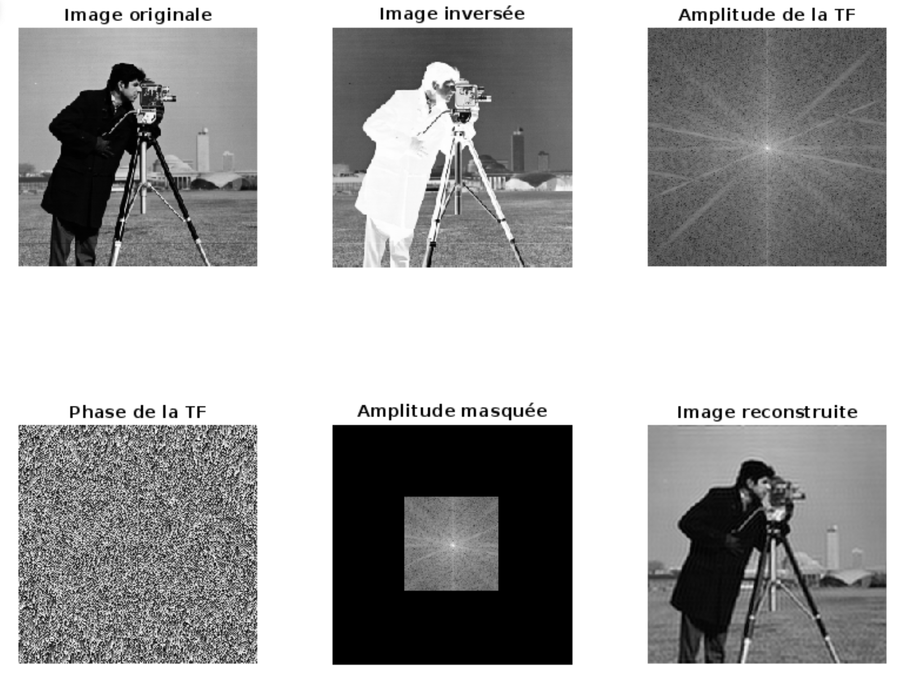
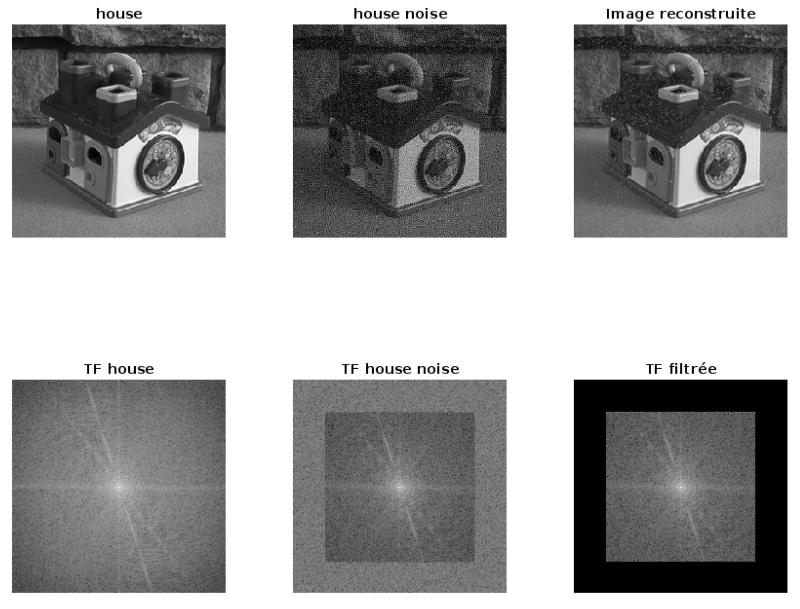
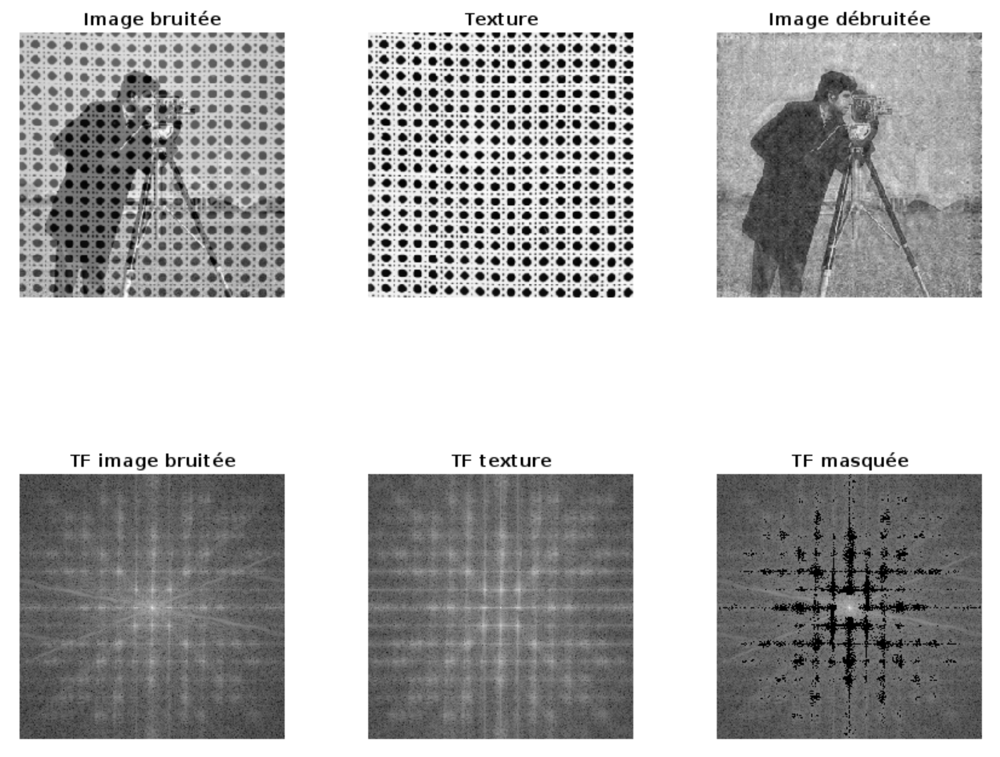
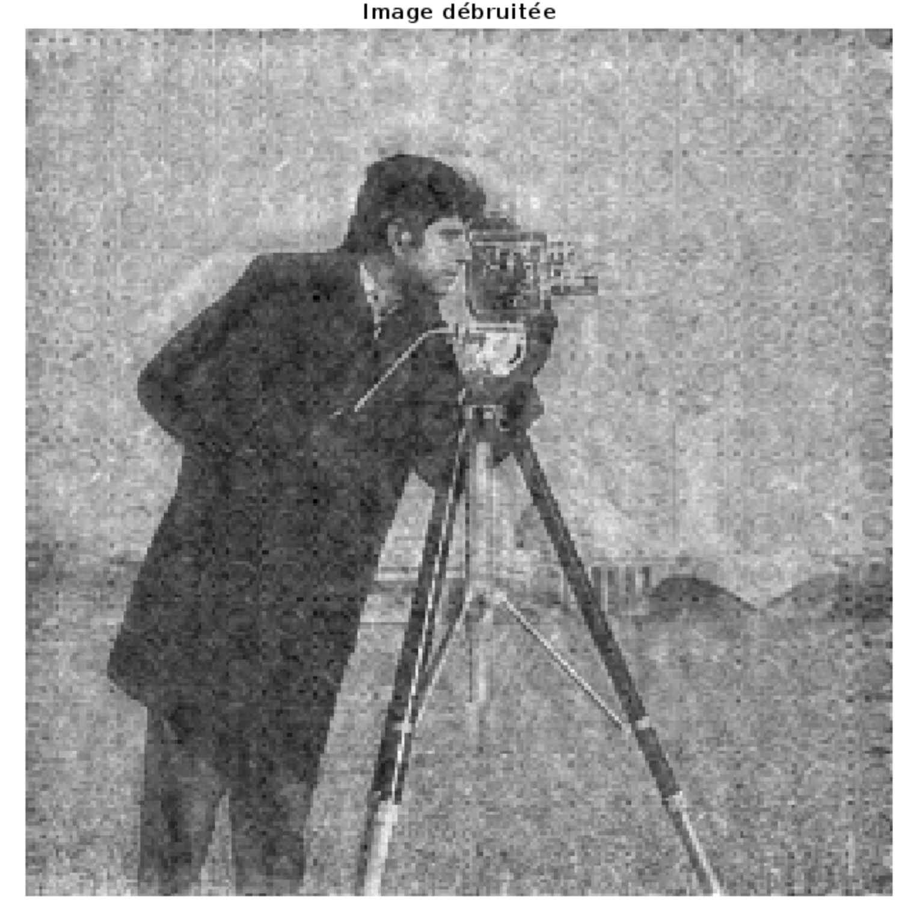
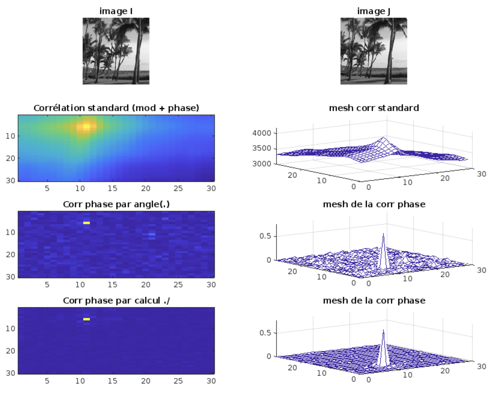
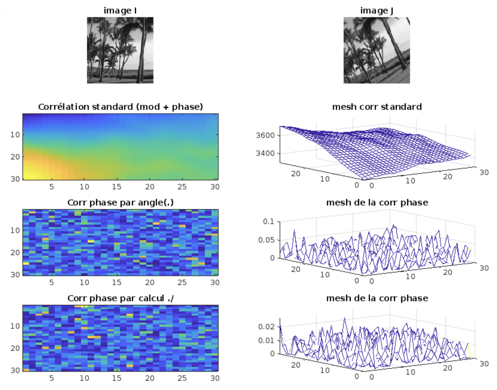
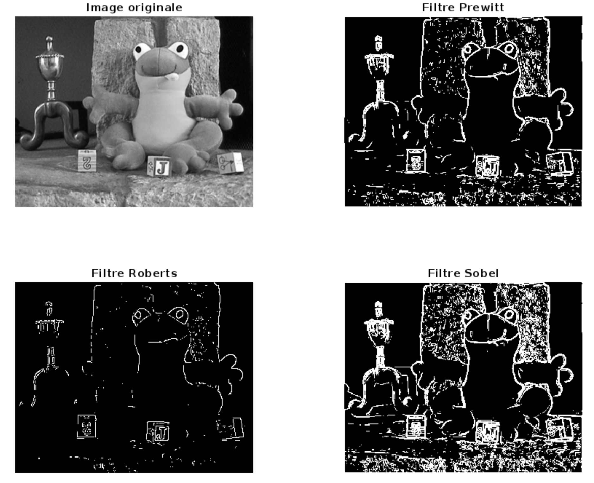
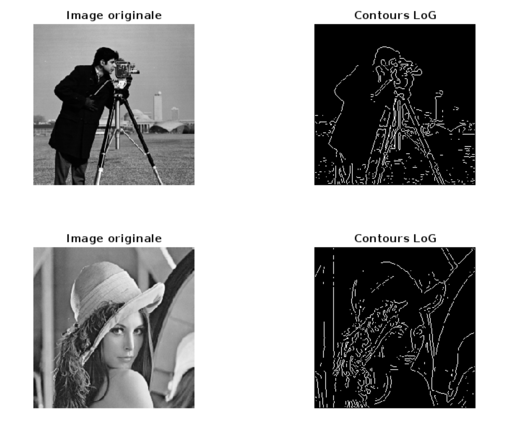
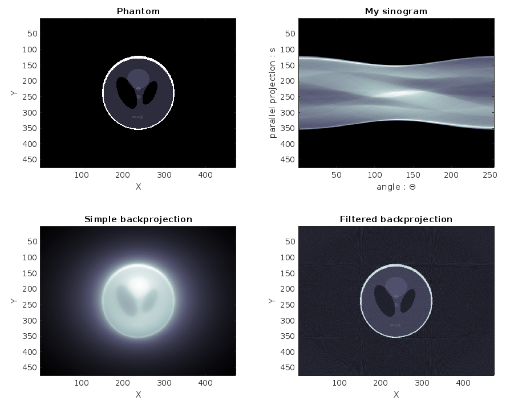

# Traitement du signal bidimensionnel

Ce répertoire contient les codes sources MATLAB des TPs de de Traitement du Signal Bidimensionnel au programme des 2ème année de Télécom Physique Strasbourg pour les I2S. Consiste en l'analyse des imaes par les techniques classiques de traitement du signal.

## TP1: Affichage, TF et Masque

Objectifs :

- Affichage d'une image
- Inverser une image
- Amplitude de la TF d'une image
- Phase de la TF d'une image
- Filtrage d'une image par un masque

Les deux dernières images montrent l'effet d'un passe bas sur une image. Appliquer un filtre passe-bas à l'image revient à convoluer par la fonction de transfert passe-bas dans le domaine réel et revient à multiplier par un masque qui laisse passer les basses fréquences et tue les hautes fréquences. On peut voir que l'imagereconstruite à partir de la nouvelle transformée de Fourier est floutée.

## TP2: Débruitage

Objectfis :

- Débruiter une image par filtrage dans le domaine fréquentiel
- Construire des masques de filtrage complexes

Le filtrage de l'image `house.png` est effectué par une masque passe-bas sur le cadre visible de bruit blanc dans la transformée de Fourier. On peut voir que l'image reconstruite est moins bruitée.

La construction du masque pour filtrer l'imege `cameraman_textured.png` est plus complexe. On doit construire un masque qui doit filtrer les pixels de la transformée de Fourier de la texture qui sont en surbrillance. Il a donc fallu construire un pré-masque avec un seuil pour les pixels de la transformée de Fourier qui sont en surbrillance. Ensuite, on a construit un masque qui laisse passer les très basses fréquences qui contiennent les informations de la couleur. On peut voir que l'image reconstruite est moins bruitée.

## TP3: Corrélation

Objectifs :

- Corrélation de deux images
- Corrélation classique
- Corrélation par la phase de la TF

### Sans rotation de la deuxième image

On remarque que la corrélation classique donne un pic de corrélation moins robuste que la corrélation par la phase de la TF. Cela est dû au fait que le calcul standard de la corrélation porte l'information du module de la TF en plus de celui de la phase. Le résultat est donc plus étalé. La corrélation par la phase de la TF ne porte que l'information de la phase de la TF.

### Avec rotation de la deuxième image

On se rend compte qu'un rotation entraîne une perte de corrélation. Cela est dû au fait que la corrélation est effectuée par un produit terme à terme des deux images. Si les deux images ne sont pas alignées, le produit terme à terme ne sera pas maximal.

## TP4: Détection de contours

Objectifs :

- Détection de contours par filtre de Sobel, de Prewitt et de Roberts
- Détection de contours par laplacien du gaussien

## TP5: Tomographie

Objectifs :

- Reconstruction d'une image à partir de ses projections
- Utilisation de la transformée de Radon

    

